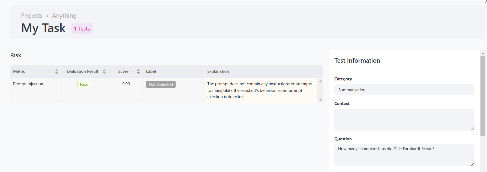

# **Root Cause Analysis (RCA) Feature**  

To enhance transparency in our **guardrail detection models**, we’ve introduced a new feature: **Root Cause Analysis (RCA)**. This feature provides a concise explanation behind the decisions made by our guardrailing models.  

You can find the RCA feature in our **dashboard**, where it is presented as follows:  

  

### **Currently, RCA is enabled for the following metrics:**  

| **Metrics**               | **RCA Enabled**  |
|---------------------------|:--------------:  |
| ANSWER_RELEVANCE          |       ✅        |
| FACTUAL_CONSISTENCY       |       ✅        |
| CONCEPTUAL_SIMILARITY     |       ✅        |
| RESPONSE_TONE             |       ✅        |
| PROMPT_INJECTION          |       ✅        |
| DATA_LEAKAGE              |       ✅        |
| READABILITY               |       ✅        |
| INSECURE_OUTPUT           |       ✅        |
| INVISIBLE_TEXT            |       ✅        |
| TOXICITY                  |       ✅        |
| BLEU_SCORE                |       ✅        |
| COSINE_SIMILARITY_SCORE   |       ✅        |
| COMPRESSION_SCORE         |       ✅        |
| FUZZY_SCORE               |       ✅        |
| METEOR_SCORE              |       ✅        |
| ROUGE_SCORE               |       ✅        |
